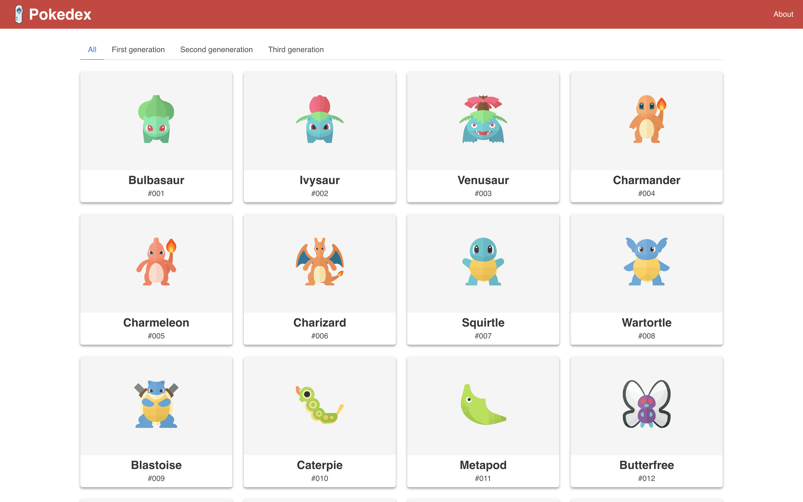
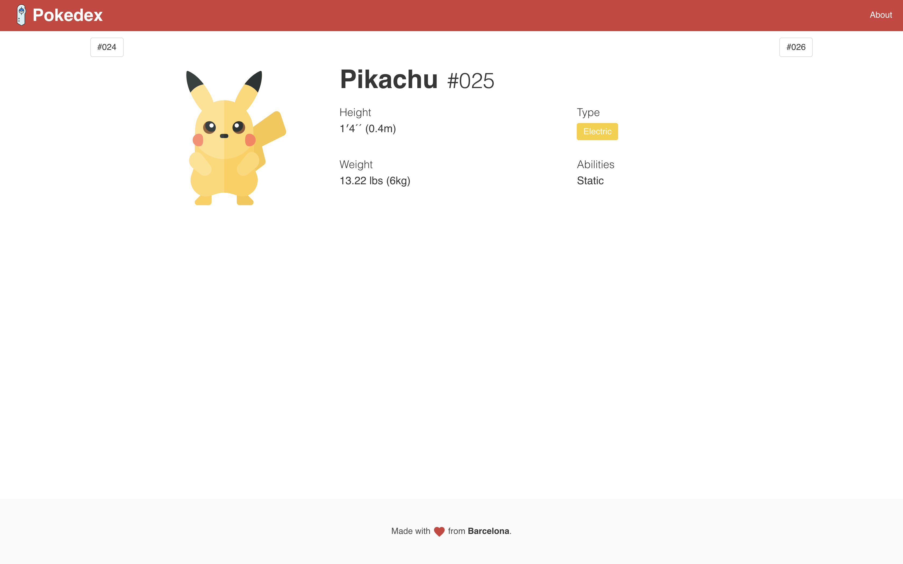

# React Pokedex

**React Pokedex** is a project made with learning purposes.

## Getting started

```sh
git clone git@github.com:magarcia/react-pokedex.git
cd react-pokedex
git checkout pokedex/6-testing
yarn install
yarn start # open localhost:3000
```

## Screenshots




